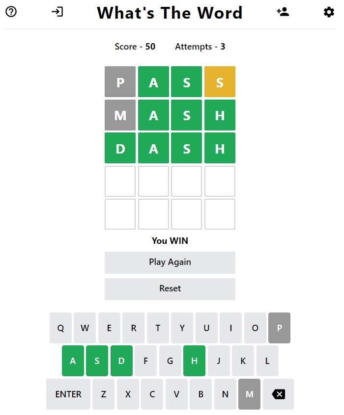

# What's the Word



## Description

What's the Word is a web-based word game that expands upon the idea of the popular New York Times game, [Wordle](https://www.nytimes.com/games/wordle/index.html), a daily puzzle where players must guess a five-letter word in up to six attempts.

In What's the Word, players can choose the length of the mystery word, with options of 4, 5, or 6 letters. Also, unike Wordle in which there is one mystery word daily, What's the Word can be played practically unlimited times back to back, with over 28,000 possible mystery words. 

Additionally, What's the Word incorporates other features to enhance the gameplay:
- Five different themes to choose from
- A login system to save your score!
- Leaderboards to see where you stand again the competition

## Table of Contents

- [Usage](#usage)
- [Credits](#credits)
- [License](#license)

## Usage

### Production
What's the Word is web-based application available at [https://cis3296f22.github.io/prj-04-whatstheword/](https://cis3296f22.github.io/prj-04-whatstheword/).

### Development
if you would like to run the application locally:
1. Download the project folder from [https://cis3296f22.github.io/prj-04-whatstheword/](https://cis3296f22.github.io/prj-04-whatstheword/)
2. Open the project folder in a terminal
3. Run the application in development mode using:
```
npm start
```
4. Navigate to [http://localhost:3000](http://localhost:3000) in a web browser

## Credits
### Developers
- Steven Altemose
- Justin Ardamoy
- Patrick Doyle
- Ryan Klein

### Built with
- [React](https://reactjs.org/)
- [Tailwind CSS](https://tailwindcss.com/)
- [Heroku](https://www.heroku.com/)

## License

Copyright 2022

Permission is hereby granted, free of charge, to any person obtaining a copy of this software and associated documentation files (the "Software"), to deal in the Software without restriction, including without limitation the rights to use, copy, modify, merge, publish, distribute, sublicense, and/or sell copies of the Software, and to permit persons to whom the Software is furnished to do so, subject to the following conditions:

The above copyright notice and this permission notice shall be included in all copies or substantial portions of the Software.

THE SOFTWARE IS PROVIDED "AS IS", WITHOUT WARRANTY OF ANY KIND, EXPRESS OR IMPLIED, INCLUDING BUT NOT LIMITED TO THE WARRANTIES OF MERCHANTABILITY, FITNESS FOR A PARTICULAR PURPOSE AND NONINFRINGEMENT. IN NO EVENT SHALL THE AUTHORS OR COPYRIGHT HOLDERS BE LIABLE FOR ANY CLAIM, DAMAGES OR OTHER LIABILITY, WHETHER IN AN ACTION OF CONTRACT, TORT OR OTHERWISE, ARISING FROM, OUT OF OR IN CONNECTION WITH THE SOFTWARE OR THE USE OR OTHER DEALINGS IN THE SOFTWARE.